# Mermaid diagram types — 10.7-safe examples

One clean example per type. All verified to parse on **Mermaid 10.7** (GitLab CE 18.7). Each is vertical-friendly and uses only stable syntax. Copy, then adapt.

> ⚠️ Avoid on 10.7: `architecture-beta` (v11), `block-beta` (v10.9), and any `layout: elk` / `defaultRenderer: elk` directive. For an architecture diagram use **flowchart + subgraphs** (first example).

---

## 1. Layered architecture (flowchart + subgraphs) — the default for 架构图

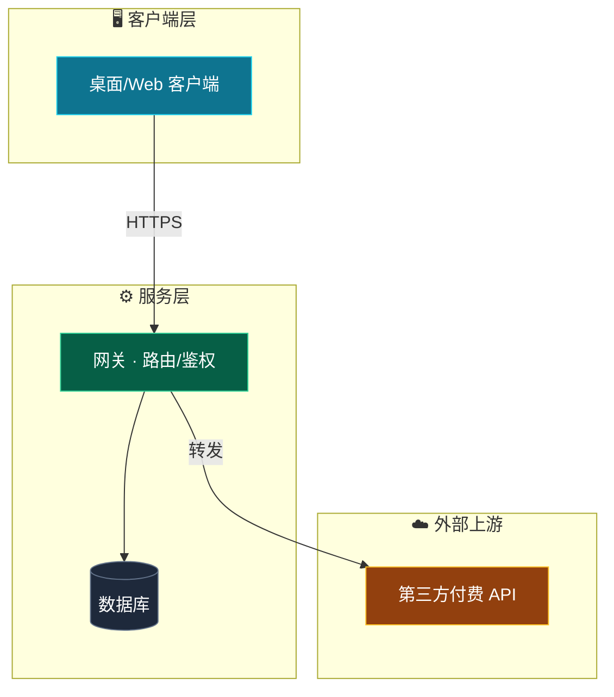

## 2. Plain flowchart (decision flow)

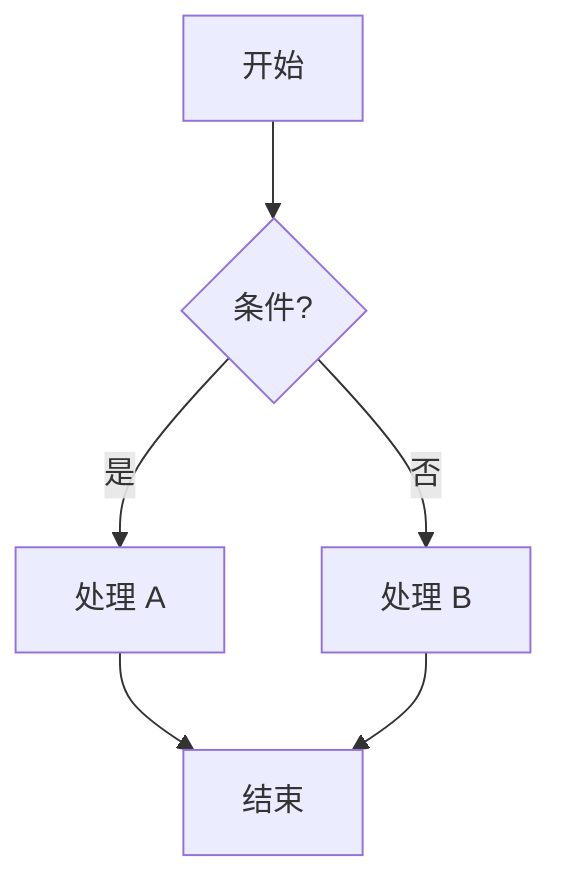

## 3. Sequence diagram (时序/交互)

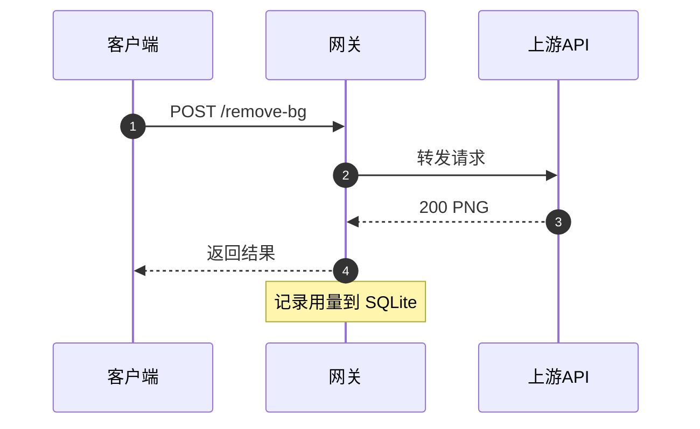

## 4. Class diagram (类/接口)

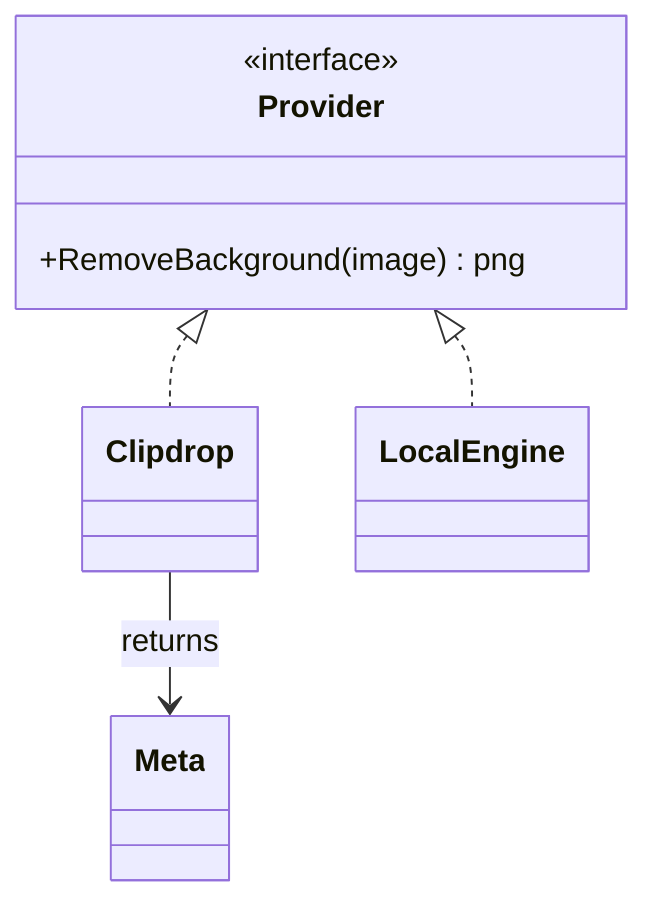

## 5. State diagram (状态机) — use stateDiagram-v2

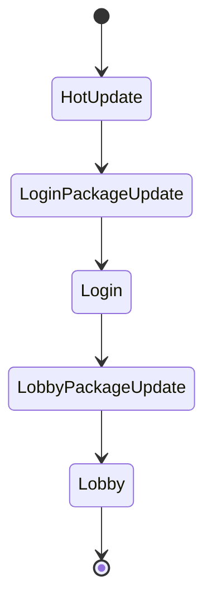

## 6. ER diagram (数据模型)

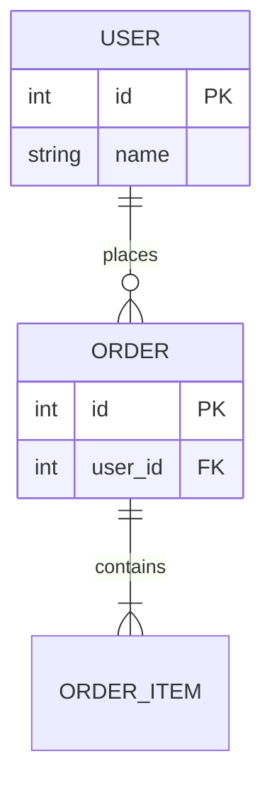

## 7. Gantt (排期)

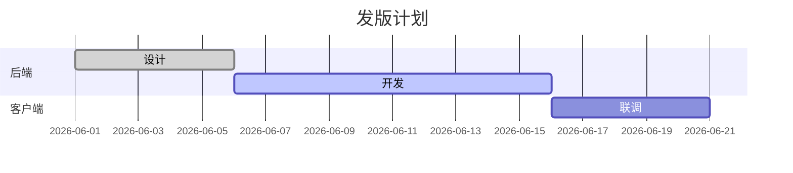

## 8. Git graph (分支)

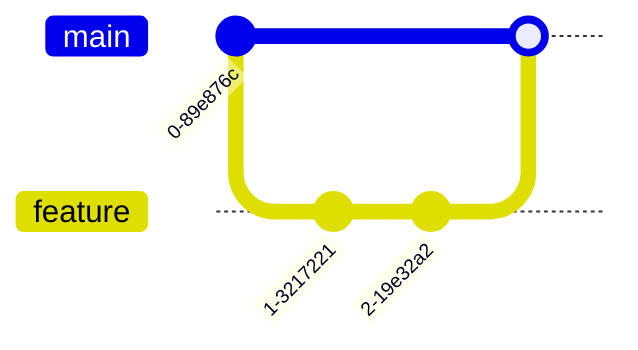

## 9. Mindmap (思维导图) — v9.3+, OK on 10.7

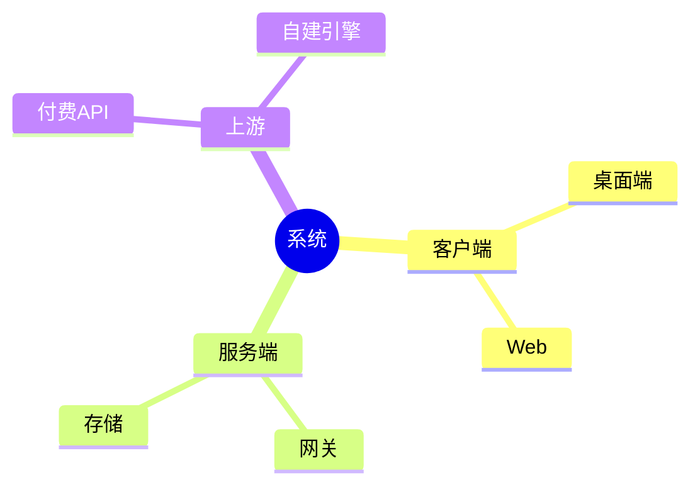

## 10. Timeline (时间线) — v10.1+, OK on 10.7

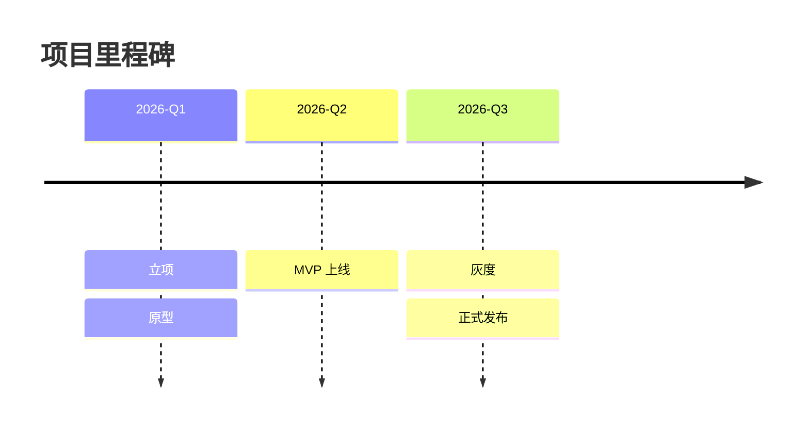

## 11. Pie (占比)

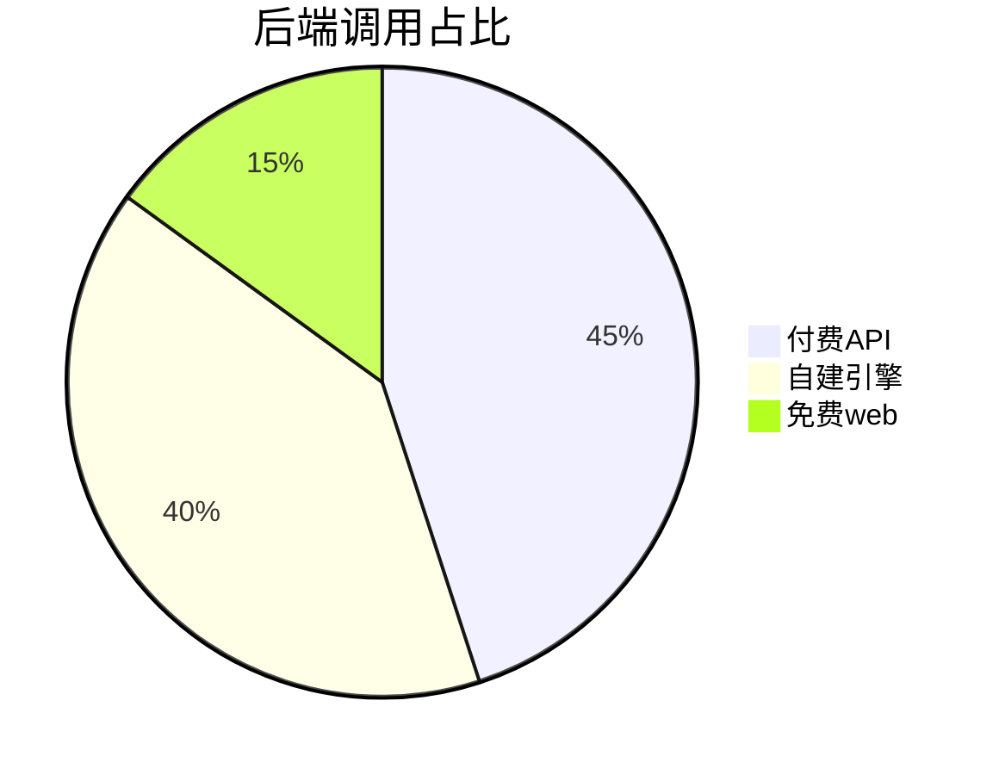

## 12. Quadrant (四象限) — v10.3+, OK on 10.7

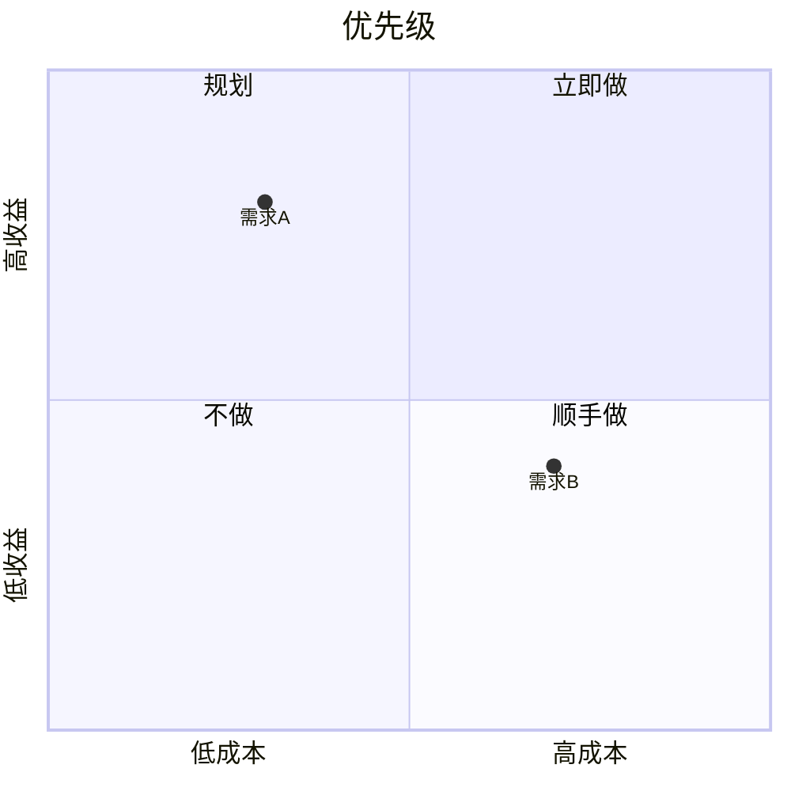
